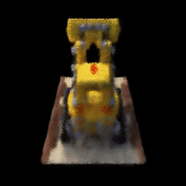

# TinyNeRF
[NeRF](http://www.matthewtancik.com/nerf) (Neural Radiance Fields) is a method that achieves state-of-the-art results for synthesizing novel views of complex scenes.

## Purpose
This repo implements a simplified NeRF model, based on [NeRF github](https://github.com/bmild/nerf) which is implemented in Tensorflow, as well as [Lin's work](https://github.com/yenchenlin/nerf-pytorch/blob/master/run_nerf_helpers.py) which implemented NeRF in Pytorch. 

In this NeRF notebook and associated python files, all the functions are detailedly annotated. They should serve as a good instruction and starting point for those who are new to NeRF, and would like to understand the fundamental concept of that brilliant model with the help of well-annotated codes.

## Method
As mentioned before, the tiny NeRF is based on [NeRF: Representing Scenes as Neural Radiance Fields for View Synthesis](http://tancik.com/nerf). Different from methods proposed in the paper, tiny NeRF model takes 3D coordinate (spatial location (x, y, z)) instead of 5D. It also skips hierarchical sampling procedure and downsizes training images, so that the model is tiny enough to train in Google Colab environment with decent training time. The tiny NeRF model would consist of four linear layer and relu activation, all the `LEGO` images are downsampled to be 200x200. These designs seem to hit the limit of free GPU RAM (~16GB) provided by Google Colab.
  


## Training Results
After training for less than 10 minutes (2000 iterations) on Tesla T4 GPU, the tiny NeRF model can synthesize novel views pretty well. Notice that the generated views are somewhat blurry, but given the short training time, the model performance is actually decent. The following gif shows the 360 degree rendering output of `LEGO`.




## Citation
Kudos to the authors for their amazing results and code implementations:
```
@misc{mildenhall2020nerf,
    title={NeRF: Representing Scenes as Neural Radiance Fields for View Synthesis},
    author={Ben Mildenhall and Pratul P. Srinivasan and Matthew Tancik and Jonathan T. Barron and Ravi Ramamoorthi and Ren Ng},
    year={2020},
    eprint={2003.08934},
    archivePrefix={arXiv},
    primaryClass={cs.CV}
}

@misc{lin2020nerfpytorch,
  title={NeRF-pytorch},
  author={Yen-Chen, Lin},
  publisher = {GitHub},
  journal = {GitHub repository},
  howpublished={\url{https://github.com/yenchenlin/nerf-pytorch/}},
  year={2020}
}
```
